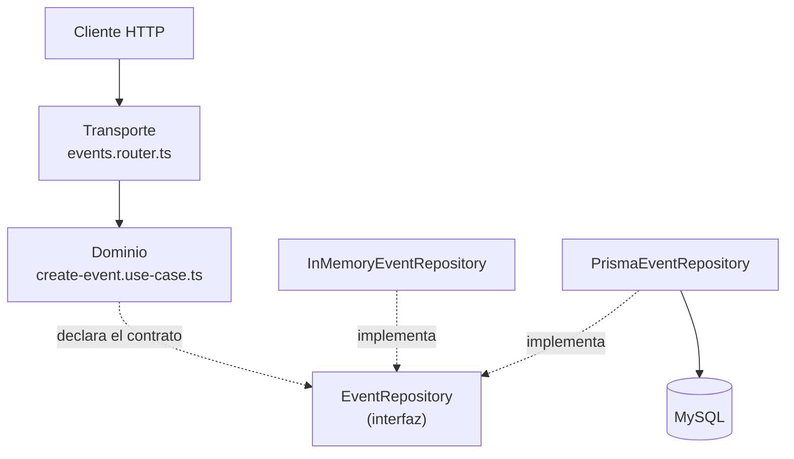

# API Ayuntamiento

API REST para la gestión de los servicios municipales de un ayuntamiento: **noticias**, **eventos**, **reservas del local municipal** y **bolsa de empleo**.

---

## 1. Descripción general

La API es el backend que consume el panel de administración del ayuntamiento y la web pública municipal. Expone cinco áreas funcionales, cada una como un módulo independiente:

| Área | Para qué sirve |
|---|---|
| **Autenticación** | Login del personal municipal y emisión de tokens JWT |
| **Noticias** | Publicación de avisos y noticias del pueblo, con imagen opcional |
| **Eventos** | Agenda municipal por categorías, con imagen opcional |
| **Reservas** | Solicitud y confirmación de reservas del local municipal |
| **Empleo** | Ofertas de trabajo publicadas por el ayuntamiento |

### Modelo de acceso

Todos los endpoints exigen un token JWT válido en la cabecera `Authorization: Bearer <token>`, **salvo estas excepciones públicas**:

| Endpoint público | Motivo |
|---|---|
| `POST /auth/login` | Es el que entrega el token |
| `GET /health` | Comprobación de estado del servicio |
| `GET /events` y `GET /events/:id` | La web municipal consulta la agenda sin autenticarse |
| `GET /bookings/calendar` | La web municipal muestra la ocupación del local sin autenticarse |
| `GET /uploads/*` | Un `` del navegador no puede adjuntar la cabecera `Authorization` |

No existe registro público de usuarios. Los administradores se crean por semilla (`npm run seed`) o manualmente en la base de datos.

### Formato de las respuestas

Respuestas en JSON. Los errores tienen siempre la forma `{ "error": "mensaje" }`, y los códigos se traducen desde los errores de dominio:

| Código | Cuándo |F
|---|---|
| `200` / `201` / `204` | Operación correcta (lectura y actualización / creación / borrado) |
| `400` | `ValidationError` — faltan campos obligatorios o el valor no es aceptable |
| `401` | Credenciales inválidas, o token ausente, mal formado o caducado |
| `404` | `NotFoundError` — el recurso no existe |
| `409` | `ConflictError` — el rango de fechas de la reserva está ocupado |
| `500` | Error no contemplado |

### Subida de imágenes

Noticias y eventos aceptan una imagen opcional. Esas peticiones se envían como `multipart/form-data` (no JSON), y el fichero se guarda en `uploads/news` o `uploads/events` con un nombre aleatorio que conserva la extensión. Lo que se persiste en base de datos es la URL pública (`/uploads/news/<fichero>`), que se sirve como estático.

El ciclo de vida del fichero está cerrado en los tres casos en los que puede quedar huérfano: al borrar el recurso, al sustituir la imagen por otra, y cuando la validación falla después de que el fichero ya se haya escrito en disco.

---

## 2. Stack tecnológico

### Ejecución y lenguaje

| Tecnología | Versión | Papel |
|---|---|---|
| **Node.js** | — | Entorno de ejecución |
| **TypeScript** | `^6.0.3` | Lenguaje. Modo `strict`, target `ES2020`, módulos CommonJS |
| **ts-node** | `^10.9.2` | Ejecuta TypeScript directamente en desarrollo y en la semilla |

### Servidor HTTP

| Tecnología | Versión | Papel |
|---|---|---|
| **Express** | `^5.2.1` | Framework HTTP: routers, middleware y servido de estáticos |
| **cors** | `^2.8.6` | Permite que el front consuma la API desde otro origen |
| **formidable** | `^3.5.4` | Parseo de `multipart/form-data` y escritura de las imágenes en disco |
| **dotenv** | `^17.4.2` | Carga la configuración desde el fichero `.env` |

### Persistencia

| Tecnología | Versión | Papel |
|---|---|---|
| **MySQL** | — | Base de datos |
| **Prisma** | `^7.8.0` | ORM y control del esquema y las migraciones |
| **@prisma/client** | `^7.8.0` | Cliente generado en `src/generated/prisma` |
| **@prisma/adapter-mariadb** | `^7.8.0` | Driver de conexión que usa el cliente |

### Seguridad

| Tecnología | Versión | Papel |
|---|---|---|
| **jsonwebtoken** | `^9.0.3` | Firma y verificación de los JWT (HS256, con caducidad) |
| **bcrypt** | `^6.0.0` | Hash de las contraseñas; el hash nunca sale en una respuesta |

### Pruebas

| Tecnología | Versión | Papel |
|---|---|---|
| **Vitest** | `^4.1.9` | Ejecutor de tests |
| **supertest** | `^7.2.2` | Peticiones HTTP contra la app sin levantar un servidor real |

### Scripts de npm

| Script | Qué hace |
|---|---|
| `npm run dev` | Arranca el servidor con ts-node |
| `npm run build` | Compila TypeScript a `dist/` |
| `npm start` | Ejecuta el build (`node dist/server.js`) |
| `npm test` | Lanza Vitest |
| `npm run seed` | Inserta el administrador inicial en la base de datos |
| `postinstall` | Ejecuta `prisma generate` tras instalar dependencias |

### Variables de entorno

| Variable | Por defecto | Para qué |
|---|---|---|
| `DATABASE_URL` | — | Cadena de conexión a MySQL. Obligatoria con `PERSISTENCE=prisma` |
| `PERSISTENCE` | memoria | Con el valor `prisma` usa MySQL; cualquier otro valor usa los repositorios en memoria |
| `PORT` | `3000` | Puerto de escucha |
| `CORS_ORIGIN` | `*` | Lista de orígenes permitidos separada por comas |
| `UPLOADS_DIR` | `./uploads` | Carpeta raíz de las imágenes subidas |
| `JWT_SECRET` | `dev-secret-change-me` | Secreto de firma del token. **Debe cambiarse en producción** |
| `JWT_EXPIRES_IN` | `3600` | Caducidad del token en segundos |
| `SEED_ADMIN_EMAIL` | `admin@ayto.local` | Credenciales del administrador semilla |
| `SEED_ADMIN_PASSWORD` | `admin1234` | |
| `SEED_ADMIN_NAME` | `Administrador` | |

---

## 3. Estructuración

El código se organiza **primero por funcionalidad** y, dentro de cada funcionalidad, **por capas**. Cada módulo de `src/modules/` es autónomo: tiene su propio dominio, su persistencia y su transporte.

```
Api-Ayto/
├── docs/
│   ├── 0001-diseno-api.md              # Contrato de la API (modelos y endpoints)
│   ├── 0002-actualizacion-booking-calendar.md  # Calendario público de reservas
│   └── 9999-arquitectura-por-capas.md  # Guía de la arquitectura
├── prisma/
│   ├── schema.prisma                   # Esquema de la base de datos
│   └── seed.ts                         # Semilla del administrador inicial
├── uploads/                            # Imágenes subidas (servidas como estáticos)
├── vitest.config.ts                    # Fuerza repos en memoria y uploads al temporal
└── src/
    ├── server.ts                       # Arranque: pone la app a escuchar
    ├── app.ts                          # Monta routers, CORS y estáticos
    ├── db/prisma.ts                    # Cliente Prisma compartido (singleton)
    ├── middleware/auth.ts              # requireAuth: valida el JWT
    ├── utils/uploads.ts                # Parser multipart y gestión de ficheros
    ├── types/                          # Tipos de librerías sin tipado propio
    ├── generated/prisma/               # Autogenerado por Prisma (no editar)
    ├── test/                           # Tests de integración por módulo
    └── modules/
        ├── auth/
        ├── news/
        ├── events/
        ├── bookings/
        └── jobs/
```

### Anatomía de un módulo

Todos siguen la misma forma. Tomando `events` como ejemplo:

```
events/
├── events.module.ts                    # Conecta las piezas (inyección de dependencias)
├── domain/                             # Reglas de negocio. Sin HTTP ni base de datos
│   ├── event.interface.ts              #   El modelo y sus tipos
│   ├── create-event.use-case.ts        #   Una acción de negocio por fichero
│   ├── list-events.use-case.ts
│   ├── get-event-by-id.use-case.ts
│   ├── update-event.use-case.ts
│   ├── delete-event.use-case.ts
│   └── errors.ts                       #   ValidationError, NotFoundError...
└── infrastructure/                     # Los detalles técnicos
    ├── persistence/
    │   ├── event.repository.ts         #   Contrato + implementación en memoria
    │   └── prisma-event.repository.ts  #   Implementación contra MySQL
    └── transport/
        └── events.router.ts            #   Rutas HTTP y códigos de respuesta
```

### Las tres capas

| Capa | Carpeta | Responsabilidad | Qué **no** hace |
|---|---|---|---|
| **Dominio** | `domain/` | Las reglas: qué campos son obligatorios, qué transiciones de estado valen, cuándo hay conflicto de fechas | No conoce Express ni Prisma |
| **Persistencia** | `infrastructure/persistence/` | Guardar y recuperar datos | No decide reglas de negocio |
| **Transporte** | `infrastructure/transport/` | Leer la petición, llamar al caso de uso, traducir el resultado a HTTP | No contiene reglas de negocio |

La dirección de las dependencias siempre apunta hacia el dominio: el dominio declara el contrato que necesita (`EventRepository`) y la infraestructura lo implementa.



### Doble implementación de la persistencia

Cada repositorio existe dos veces detrás del mismo contrato, y el fichero `*.module.ts` elige cuál usar según `PERSISTENCE`:

- **`InMemory...Repository`** — guarda en memoria. Es la que usan los tests, que así corren sin base de datos.
- **`Prisma...Repository`** — guarda en MySQL.

Como el dominio solo conoce la interfaz, cambiar de una a otra no toca ninguna regla de negocio.

### Tests

Cinco ficheros en `src/test/`, uno por módulo, con **171 tests de integración** que recorren la pila completa vía supertest. `vitest.config.ts` fuerza `PERSISTENCE=memory` y redirige `UPLOADS_DIR` al temporal del sistema, de modo que los tests no tocan la base de datos ni dejan ficheros en el repositorio.

---

## 4. Funcionalidades

### Autenticación — `/auth`

JWT firmado con HS256 y caducidad configurable. El middleware `requireAuth` verifica el token y adjunta su payload a `req.auth`.

| Método | Ruta | Token | Descripción |
|---|---|:---:|---|
| `POST` | `/auth/login` | — | Recibe `{ email, password }` y devuelve `{ token, user }` |
| `GET` | `/auth/me` | ✅ | Devuelve el usuario autenticado |
| `POST` | `/auth/logout` | ✅ | Confirma el cierre de sesión |

Detalles del comportamiento:

- Las contraseñas se comparan contra un hash **bcrypt**. El usuario se serializa siempre a través de `toPublicUser()`, así que el `passwordHash` nunca aparece en una respuesta.
- Un email inexistente y una contraseña incorrecta devuelven **el mismo error**, para no revelar qué cuentas existen.
- El logout es **stateless**: al ser JWT, el cierre efectivo lo hace el cliente descartando el token. El endpoint solo confirma que la petición estaba autenticada.
- Con `PERSISTENCE` en memoria, el administrador semilla se crea al arrancar. Contra MySQL hay que ejecutar `npm run seed`.

### Noticias — `/news`

Avisos y noticias del pueblo. **Todos los endpoints requieren token.**

| Método | Ruta | Descripción |
|---|---|---|
| `GET` | `/news` | Lista todas las noticias |
| `GET` | `/news/:id` | Obtiene una noticia |
| `POST` | `/news` | Crea una noticia — `multipart/form-data` |
| `PUT` | `/news/:id` | Actualiza una noticia — `multipart/form-data` |
| `DELETE` | `/news/:id` | Elimina una noticia y su imagen |

**Modelo:** `id`, `title`, `description`, `image` (opcional), `uploadDate` (autogenerada).

Reglas: `title` y `description` son obligatorios y se recortan de espacios. Si un `PUT` no adjunta imagen nueva, se conserva la que ya había.

### Eventos — `/events`

Agenda municipal. **Las lecturas son públicas**; crear, actualizar y borrar requiere token.

| Método | Ruta | Token | Descripción |
|---|---|:---:|---|
| `GET` | `/events` | — | Lista todos los eventos |
| `GET` | `/events?category=Deportivo` | — | Filtra por categoría |
| `GET` | `/events/:id` | — | Obtiene un evento |
| `POST` | `/events` | ✅ | Crea un evento — `multipart/form-data` |
| `PUT` | `/events/:id` | ✅ | Actualiza un evento — `multipart/form-data` |
| `DELETE` | `/events/:id` | ✅ | Elimina un evento y su imagen |

**Modelo:** `id`, `title`, `description`, `image` (opcional), `eventDate`, `category`, `creationDate` (autogenerada).

**Categorías:** `Deportivo`, `Festivo`, `Religioso`, `Otro`. Se almacenan ya en español porque son el texto que se muestra; no hay capa de traducción.

Reglas: `title`, `description`, `eventDate` y `category` son obligatorios.

### Reservas del local municipal — `/bookings`

Solicitud y confirmación de reservas. **La gestión requiere token**; la consulta del calendario es pública.

| Método | Ruta | Token | Descripción |
|---|---|:---:|---|
| `GET` | `/bookings/calendar` | — | Días ocupados y su estado, sin datos del solicitante |
| `GET` | `/bookings` | ✅ | Lista todas las reservas |
| `GET` | `/bookings/:id` | ✅ | Obtiene una reserva |
| `POST` | `/bookings` | ✅ | Crea una solicitud (nace en estado `pending`) |
| `PUT` | `/bookings/:id` | ✅ | Actualiza una reserva, incluido su estado |
| `DELETE` | `/bookings/:id` | ✅ | Elimina una reserva |

**Modelo:** `id`, `name`, `phone`, `startDate`, `endDate`, `state`, `notes` (opcional), `createDate` (autogenerada).

Es el módulo con más lógica de negocio propia:

- **Tres estados.** `pending` (solicitada), `reserved` (confirmada por el ayuntamiento) y `free`. Este último es **calculado**: significa "sin reserva activa" y no se persiste como registro.
- **Reserva por día completo.** Los solapes se comparan a nivel de día (`YYYY-MM-DD`), ignorando la hora. Dos rangos entran en conflicto si comparten al menos un día, de forma inclusiva en ambos extremos.
- **Solo `pending` y `reserved` bloquean el calendario.** Son los estados que ocupan fechas al comprobar disponibilidad.
- **Conflicto de fechas → `409`.** Crear o actualizar una reserva sobre un rango ya ocupado se rechaza.
- **`free` no es asignable.** El `PUT` solo acepta `pending` o `reserved`; cualquier otro valor devuelve `400`.

#### Calendario público

Hay dos consumidores con necesidades distintas. El **panel de administración** usa los endpoints protegidos y recibe la reserva completa, con solicitante y observaciones. La **web municipal** solo necesita pintar un calendario de ocupación, y no debe recibir datos personales.

`GET /bookings/calendar` cubre ese segundo caso. Acepta dos parámetros opcionales, `from` y `to` en formato `YYYY-MM-DD` (por defecto, desde hoy y sin límite), y devuelve un elemento por día ocupado:

```json
[
  { "date": "2026-07-01", "state": "reserved" },
  { "date": "2026-07-02", "state": "reserved" },
  { "date": "2026-07-05", "state": "pending" }
]
```

- **Solo aparecen los días ocupados.** Un día ausente de la respuesta está libre, así que `free` nunca se envía.
- **Una reserva de varios días se expande a un elemento por día**, para que la web no tenga que calcular rangos.
- **Nunca se exponen `name`, `phone`, `notes`, `id` ni `createDate`.** Únicamente el día y su estado.

El contrato completo, con los errores y las decisiones de privacidad, está en [docs/0002-actualizacion-booking-calendar.md](docs/0002-actualizacion-booking-calendar.md).

### Ofertas de trabajo — `/jobs`

Bolsa de empleo municipal, CRUD completo en JSON. **Todos los endpoints requieren token.**

| Método | Ruta | Descripción |
|---|---|---|
| `GET` | `/jobs` | Lista todas las ofertas |
| `GET` | `/jobs/:id` | Obtiene una oferta |
| `POST` | `/jobs` | Crea una oferta |
| `PUT` | `/jobs/:id` | Actualiza una oferta |
| `DELETE` | `/jobs/:id` | Elimina una oferta |

**Modelo:** `id`, `title`, `description`, `requirements`, `companyName`, `phone` (opcional), `email` (opcional), `createDate` (autogenerada).

Reglas: `title`, `description`, `requirements` y `companyName` son obligatorios; los datos de contacto son opcionales.

### Servicio — `/health`

| Método | Ruta | Token | Descripción |
|---|---|:---:|---|
| `GET` | `/health` | — | Devuelve `{ status: "ok" }` |

### Ficheros estáticos — `/uploads`

Sirve las imágenes de noticias y eventos desde la carpeta `UPLOADS_DIR`. Es público a propósito: el navegador las solicita desde un ``, que no puede adjuntar la cabecera `Authorization`.

Al borrar el fichero, la ruta se resuelve y se comprueba que sigue cayendo dentro de la carpeta de subidas, de modo que un valor manipulado no pueda alcanzar ficheros ajenos.